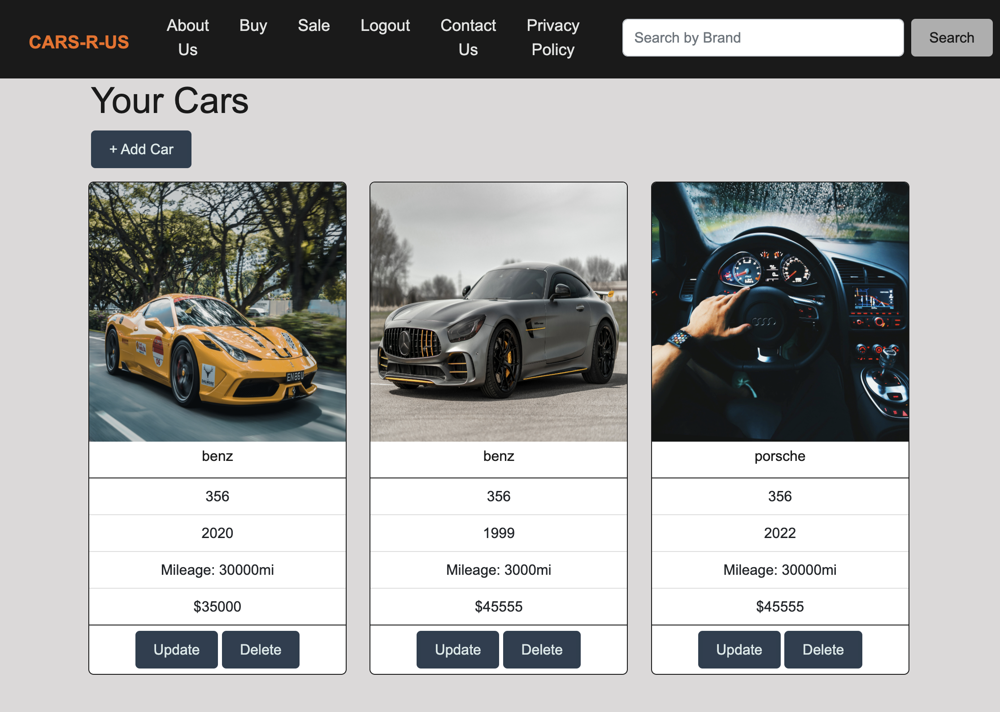

# Cars R Us

  

  ## Table Of Contents
  * [Description](#description)
  * [Deployment](application-deployment)
  * [Screenshot](application-screenshot)
  * [Installation](#installation)
  * [Usage](#usage)
  * [Contribution](#contribution)
  * [Test](#test)
  * [License](#license)
  * [Question(s)](#questions)

  ## Description
  Cars R Us is a webpage created to give buyers and sellers a place to sell and buy vehicles easily and efficiently. It allows salers to sign up and login to the webpage to list their vehicles for anyone to see. They will also be able to keep track of their vehicle ads through their accounts. They will be able to list their make, model, year, mileage, pictures of the vehicle, and their contact info for buyers to get a hold of them.

  ## Application Deployment

  
  ## Application Screenshot
  

  ## Installation
  The installations needed include bcrypt, sequelize, dotenv, express, handlebars, heroku, node, and sql.

  ## Usage
  For sellers they will need to create an account with a name, email, and password. Then they'll be able to list their vehicles and contact info for buyers to see. Buyers will be able to just open the webpage and search for their vehicle of choice and have anything available from sellers show up on the webpage.

  ## Contribution
  Xiaojing Deng who mainly focused on frontend. Daniel Vidal who mainly focused on the controllers. Mahmoud Khalil who mainly focused on the addcar.handlerbars, updatecar.handlebars, addcar.js, updatecar.js. Khalil Khalil who mainly focused on the seeds, signup.handlerbars, login.handlebars,  public/login.js, public/logout.js. Everyone also contributed to other assignments when help was needed.

  ## Test
  Coders are manually testing the code.

  ## License
  https://opensource.org/licenses/ISC

  ## Question(s)
  If you have any questions about this project you can reach us at:
  * GitHub: https://github.com/xiaojing168jmg168, https://github.com/DVidal1209, https://github.com/MHKhalil1, https://github.com/KJKhalil.
  * Email: 8redfishcreative@gmail.com, daniel.vidal17@yahoo.com, khalilmahmoud2333@gmail.com, khalil.j.khalil@hotmail.com.
